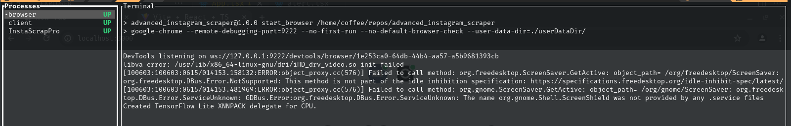
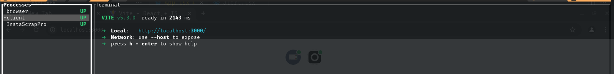
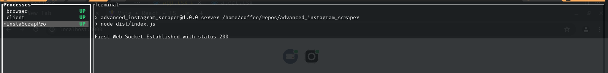

# InstaScrape Pro

### Product Description: Instascrape Pro

**InstaScrape Pro** is an advanced tool designed to automate data extraction from Instagram profiles, saving you time and effort. Perfect for marketers, researchers, and businesses, InstaScrape Pro efficiently gathers valuable information from target accounts.

#### Key Features:

1. **Keyword-Based Search**:
   - Automatically searches for profiles using keywords such as "furniture" or "interior design."

2. **Comprehensive Data Extraction**:
   - Collects essential data points from each profile, including:
     - Username
     - Location/City
     - Country
     - Email (via "Contact Us" button)
     - Phone number (if available)
     - Link to the most recent post
     - Following count
     - Follower count
     - Instagram bio

3. **Automated Following**:
   - Follows each profile after extracting data to expand your network and discover more related accounts.

4. **Suggested Profiles Navigation**:
   - Utilizes Instagram's suggested profiles feature to continuously find and scrape similar accounts.

5. **CSV Export**:
   - Organizes all collected data into a CSV file with clear labels for easy analysis and integration.

#### Benefits:

- **Time-Saving**: Automates the repetitive task of data collection.
- **Accurate Data**: Ensures precise extraction and organization of profile information.
- **Network Expansion**: Helps you follow and connect with relevant profiles in your industry.

Transform your Instagram data collection with InstaScrape Pro, the ultimate tool for efficient and comprehensive profile scraping.


### INSTALATION 

#### **prerequisites** 

    - nodejs version 18 or later 
        you can find out how to install node here : https://nodejs.org/en 
    - pnpm 
        you can find how to install pnpm here: https://pnpm.io/installation

after you setup the prerequisites you can install the application by running on your terminal


```
pnpm install

```

#### SETUP


## How It Works

The process utilizes Chrome's browser debugging tools to host our application and create a seamless connection between the scraper and the front end. This integration allows you to observe the scraper's activity directly within the same browser as the application, eliminating the need for a separate browser instance.

We built a Websockets server to handle communication events. Currently, there are two main events: `NewSearch` and `LogIn`. The system is scalable for additional events, such as single profile searches or keyword collection maybe in the future ...


##  USAGE 

```
pnpm run start

```
## Process Overview

### Browser Process
Starts the browser with a personalized profile, ensuring our accounts and history persist during program execution.



### Client Process
Starts our website on port 3000.



### Scraper Process and WebSocket Server
Starts the WebSocket server, allowing communication between our client and the scraper.



### Keyword Input
This is where you will input your keywords. **Please make sure they are comma-separated**; otherwise, it will break.


### Status
Displays the connection status of the server and whether you are logged in to Instagram. Click on the Instagram logo to start the login process.


### OUTPUT 
due to the complexity of the object collected from the user profile it would be almost impossible to read it from a csv file so we went for a much better solution using "files" that is and its JSON format 
you can find an example output in "furniture.json" file 

ENJOY AND HAPPY HACKING 

If you have any questions please feel free to contact us we will be happy to answer you and help you 
